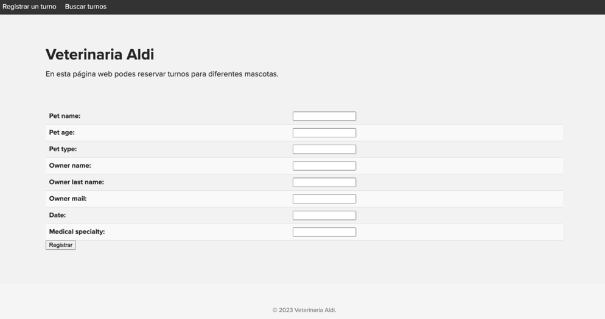
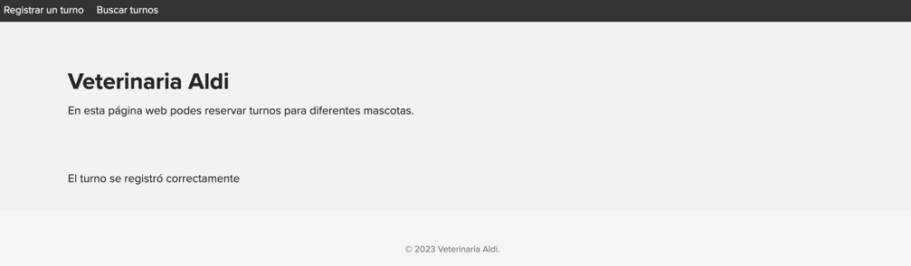
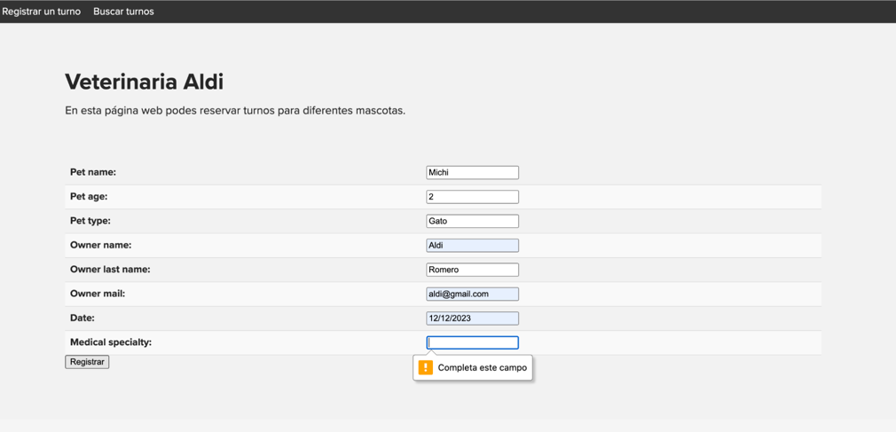
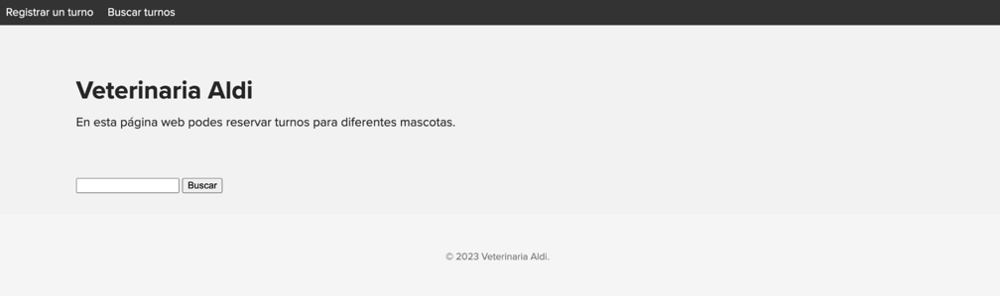
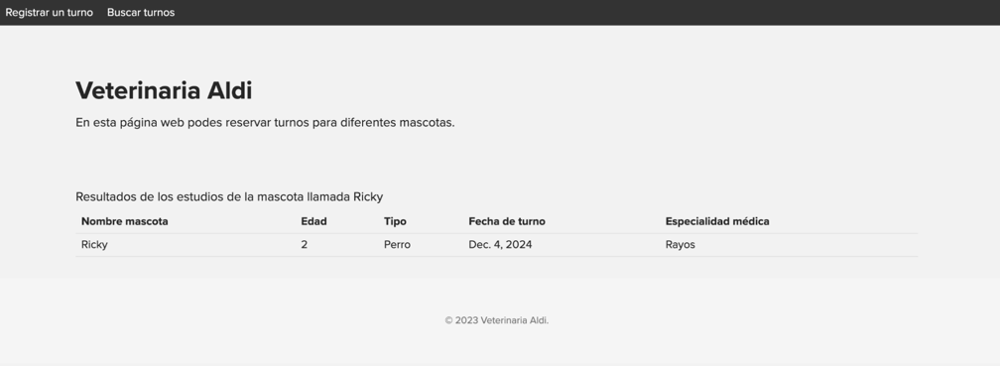
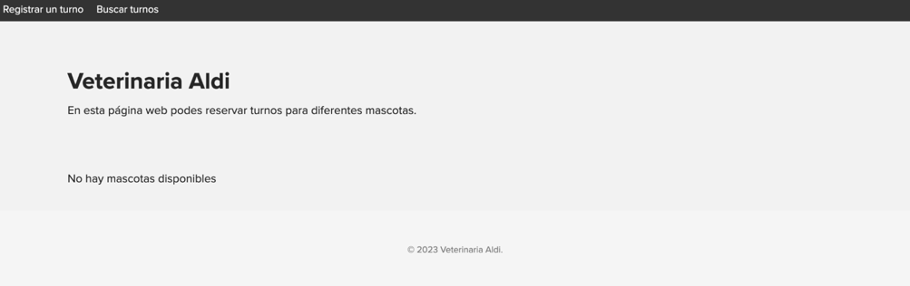

# Instrucciones de uso
### Levantar el proyecto
Para poder correr el proyecto se debe ejecutar el siguiente comando ubicandose en la raiz del proyecto

`python manage.py runserver
`
### Recorrido por los casos de uso

Luego por medio del browser, ingresar a http://localhost:8000/ esto nos va a llevar la primera página donde nos permite reservar turnos

En ellas podemos ingresar los tados para el usuario, la mascota y los requerimientos del turno.
Al hacer click en el botón de “Registrar”
Nos guarda el turno.

En caso de no ingresar correctamente un campo, nos figurará un cartel informando el error

Podemos acceder al menu que figura en la parte superior de la pantalla para poder buscar los turnos buscando por nombre de mascota.

Colocando un nombre y haciendo click en “Buscar”, vamos a visualizar una tabla con los resultados.

Si buscamos nombres de las mascotas no existen se nos redireccionará a la siguiente pantalla:

